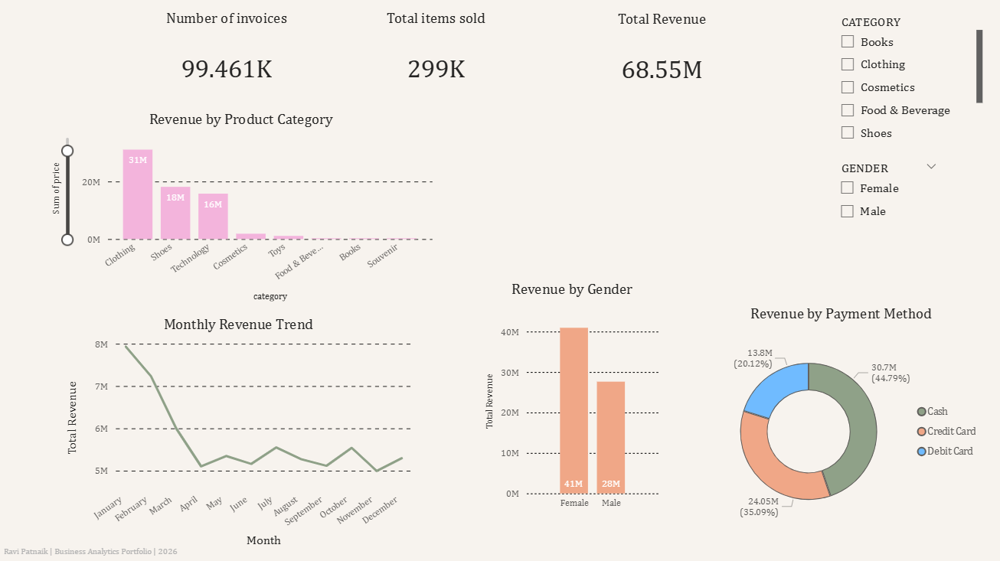
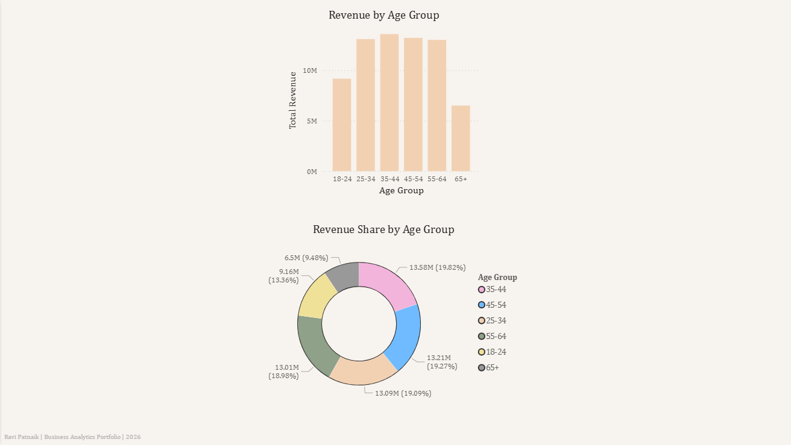
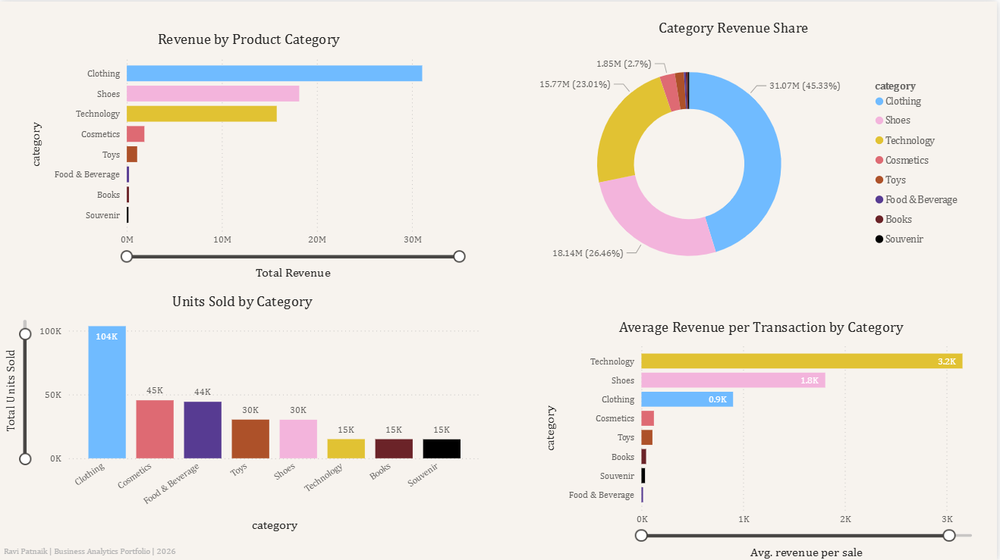
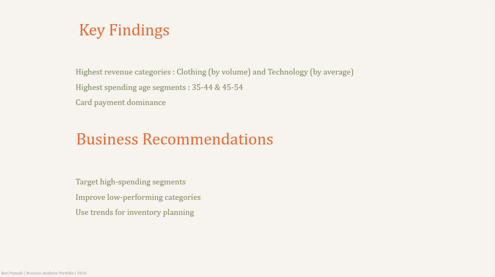

# Customer Spending Insights  
Python Analytics Project – Retail Customer Behaviour

## 📌 Project Overview
This project analyses retail shopping behaviour using a real-world customer transactions dataset.  
The goal is to uncover insights about spending patterns, customer segments, and monthly sales trends to support data-driven marketing and operational decisions.

This project was completed using Python (Pandas, Matplotlib, Seaborn) and later extended into Power BI.

---

## 🧹 1. Data Cleaning & Preparation
Key steps performed:
- Handled missing values  
- Fixed inconsistent category labels (e.g., *Clothi → Clothing*, *Boks → Books*)  
- Corrected gender and payment method typos  
- Converted data types for optimisation  
- Detected outliers using the IQR method  
- Removed duplicates and validated data consistency  

The dataset was cleaned and prepared for accurate analysis and visualisation.

### Dataset Source
This analysis uses the publicly available **Customer Shopping Dataset** from Kaggle.  
The dataset is not included in this repository to comply with dataset licensing and distribution guidelines.

---

## 📊 2. Exploratory Data Analysis (EDA)

### **Customer Demographics & Behaviour**
- Age distribution is wide (18–70), attracting a diverse audience.
- Spending behaviour is **similar across genders**.
- Price distribution shows frequent low–mid purchases and occasional premium buys.

### **Product Category Insights**
- Top revenue categories: **Clothing, Shoes, Technology**  
- Lower-performing categories: **Books, Souvenir, Food & Beverage**

### **Age Group Analysis**
- Average spending is stable across age groups.
- No age group significantly outspends another → age is NOT a spending predictor.

### **Payment Preferences**
- Cash (45%) and Credit Card (35%) dominate sales.
- Debit Card is least used.

### **Sales Trend Over Time**
- Monthly sales remain stable (2.4M–2.8M).  
- Mid-year and end-of-year peaks indicate seasonal demand.  
- Final-month drop likely due to incomplete data.

---

## 💡 3. Key Insights Summary
- Spending behaviour is **not driven by age or gender**.  
- High-value purchases are distributed across many customer types.  
- Clothing, Shoes, and Technology should be prioritised for marketing investment.  
- Card transactions represent a key area for financial partnerships.

---

## 📈 4. Business Recommendations

1. **Prioritise High-Revenue Categories**  
   Increase investment and targeted campaigns for Clothing, Shoes, and Technology.

2. **Payment Method Promotions**  
   Partner with payment providers to offer cashback/discounts and encourage more digital adoption.

3. **Seasonal Campaign Planning**  
   Align promotions with the consistent mid-year and November sales peaks.

4. **Occasion-Based Instead of Age-Based Targeting**  
   Since age does not influence spending, focus on behaviour-driven segments (e.g., frequent buyers, premium buyers).

5. **Create a Premium Customer Track**  
   High-value outliers suggest a loyal segment willing to make large purchases.  
   Build loyalty programs or personalised recommendations for them.

---

## 🛠️ Tools & Technologies
- **Python:** Pandas, NumPy, Matplotlib, Seaborn  
- **Jupyter Notebook**  
- **Power BI**  
- **Git & GitHub**

---
## 📊 Phase 2 – Power BI Dashboard

This project was extended into an interactive Power BI dashboard to transform the Python-based analysis into a business intelligence reporting solution.

### Dashboard Features
- Executive KPI overview
- Customer spending analysis
- Product performance insights
- Revenue trend visualisation
- Business recommendations dashboard
- Interactive filtering and category analysis

### Power BI Dashboard Pages
1. Executive Overview
2. Customer Insights
3. Product Performance
4. Insights & Recommendations

### Key Business Insights
- Clothing and Technology generated the highest overall revenue.
- Customers aged 35–54 represented the highest spending segment.
- Card-based transactions dominated customer payment behaviour.
- Certain categories generated high average transaction values despite lower sales volume.

### Dashboard Screenshots

#### Executive Overview

#### Customer Insights

#### Product Performance

#### Insights & Recommendations

---

## 👤 Author
Sai Ravi Krishna Patnaik  
Master of Business Analytics – Macquarie University  

